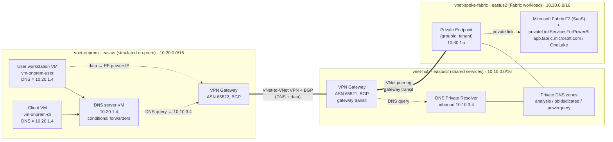

# Microsoft Fabric over Private Link — Infrastructure as Code

Deploys a **Microsoft Fabric F2 capacity** that is reachable **only over Private Link / VPN** (no
public internet), in a **hub‑and‑spoke** topology, plus a **simulated on‑premises network** that
resolves and reaches the Fabric private endpoint through DNS conditional forwarding.

Authored in **Bicep** and compiled to an **ARM template** (`azuredeploy.json`) so it can be deployed
three ways: the GitHub **Deploy to Azure** button, the **Azure CLI**, or **`azd provision`**.

> ⚠️ **Cost & time:** this lab provisions an F2 capacity, **two VPN gateways**, 3 VMs, a DNS Private
> Resolver, and (optionally) Bastion. VPN gateways take a long time to provision and the whole
> environment incurs real cost. Tear it down when finished (see [Clean up](#clean-up)).

---

## Architecture



This follows the **hub‑and‑spoke** model: the **hub** holds shared connectivity and DNS services
(VPN gateway + DNS Private Resolver), and the **whole Fabric workload** — the F2 capacity (SaaS), the
tenant `privateLinkServicesForPowerBI`, and the private endpoint — belongs to the peered **spoke**.
The simulated **on‑premises** network has a **user workstation** and a **client** VM (both resolve via
the on‑prem DNS server) and connects to the hub over a VNet‑to‑VNet VPN.

> **Accuracy note:** only the **private endpoint** is literally network‑injected into the spoke
> subnet. The **F2 capacity** is a regional Azure resource and **privateLinkServicesForPowerBI** is a
> tenant/global resource, and Fabric itself is a Microsoft‑managed **SaaS** — they're grouped with the
> spoke as the workload it represents and reaches privately (`app.fabric.microsoft.com`, OneLake).

Both the **DNS query traffic** (on‑prem DNS server → resolver inbound `10.10.3.4` in the hub) and the
subsequent **data traffic** (on‑prem client → the private endpoint IP in the spoke) cross the
**VNet‑to‑VNet VPN tunnel**. The data path additionally transits **hub → spoke** via VNet peering.

**Routing — how on‑prem reaches the spoke (important):**

- The hub→spoke peering enables **gateway transit** (`allowGatewayTransit`); the spoke→hub peering
  sets **`useRemoteGateways`**, so the spoke uses the hub's VPN gateway.
- **BGP is enabled on both VPN gateways and both VNet‑to‑VNet connections** (distinct ASNs
  `65521` / `65522`). This is what advertises the **spoke prefix `10.30.0.0/16`** across the VPN to
  on‑premises — without it, on‑prem would resolve the private IP but have no route to the spoke.
- Address spaces are deliberately non‑overlapping (`10.10` hub / `10.20` on‑prem / `10.30` spoke) to
  satisfy the gateway‑transit duplicate‑prefix rule.

**DNS resolution flow (on‑prem → Fabric):**

1. The on‑prem **client VM** uses the on‑prem **DNS server VM** (`10.20.1.4`) as its resolver.
2. The DNS server has **conditional forwarders** for the Fabric/Power BI public parent domains
   (`analysis.windows.net`, `pbidedicated.windows.net`, `prod.powerquery.microsoft.com`,
   `powerbi.com`, `fabric.microsoft.com`) pointing at the **Azure DNS Private Resolver**
   inbound endpoint (`10.10.3.4`) across the VPN. A **default forwarder** to `168.63.129.16` keeps
   all other name resolution working.

   > **Use the broad parent domains** (`powerbi.com`, `fabric.microsoft.com`) — **not** the narrow
   > `app.powerbi.com` / `app.fabric.microsoft.com`. A narrow `app.*` forwarder leaks **OneLake**
   > (`onelake.dfs/blob.fabric.microsoft.com`) to public DNS, because OneLake's public CNAME chain
   > resolves fully before the `privatelink` hop is re‑queried. Forwarding the parent sends the whole
   > Fabric/Power BI name family — portal, APIs, and OneLake — to the private resolver.
3. The resolver answers from the **private DNS zones** (linked to the hub VNet, where the resolver
   lives), returning the **private IP** of the Fabric private endpoint — which sits in the spoke —
   via the `CNAME → privatelink` chain.

> **Trade-off:** because `powerbi.com` / `fabric.microsoft.com` are conditionally forwarded
> to the resolver, on‑prem resolution of the Fabric **portal** (not just private data endpoints)
> depends on the VPN tunnel + resolver being up. If the tunnel is down, those names are
> unresolvable from on‑prem — the expected cost of routing them privately.

---

## Prerequisites (must be done before / alongside deployment)

These are **Fabric admin‑portal tenant settings — they are not deployable via ARM/Bicep**:

1. **Enable Azure Private Link for the tenant.** In **Fabric → Admin portal → Tenant settings →
   Azure Private Link**, set the toggle to **Enabled**. It takes ~15 minutes to configure the
   tenant FQDN. The `Microsoft.PowerBI/privateLinkServicesForPowerBI` resource in this template
   **will fail to create until this is enabled** — set `deployFabricPrivateLink=false` to deploy the
   network first, then re‑deploy with it `true` after enablement.
   <br/>Docs: [Set up and use tenant-level private links](https://learn.microsoft.com/fabric/security/security-private-links-use)
2. You must be a **Fabric administrator** and the deploying identity needs rights to create a Fabric
   capacity. `fabricCapacityAdmin` must be a **real Entra user UPN** (or service‑principal object id).
3. After verifying private access, optionally enable **Block Public Internet Access** (Admin portal →
   Tenant settings → Advanced networking) to fully lock Fabric to private endpoints.

> **Important:** A newly created capacity can take **up to 24 hours** to be reflected in the private
> DNS zone, and the tenant private endpoint connection may need approval. Do not treat an immediate
> post‑deploy `nslookup` failure as a deployment error. See
> [Verify](#verify-private-resolution).

---

## Deploy

Pick **one** of the three paths. All use the same modules.

### 1) Deploy to Azure button (portal)

**Lab** — full hub‑spoke + simulated on‑prem + VPN + VMs + a **new** F2 capacity:

[](https://portal.azure.com/#create/Microsoft.Template/uri/https%3A%2F%2Fraw.githubusercontent.com%2Fytthuan%2Ffabric-privatelink%2Fmain%2Fazuredeploy.json)

**Production** — tenant Private Link landing only (no on‑prem); **use an existing** Fabric capacity **or create a new** one:

[](https://portal.azure.com/#create/Microsoft.Template/uri/https%3A%2F%2Fraw.githubusercontent.com%2Fytthuan%2Ffabric-privatelink%2Fmain%2Finfra-prod%2Fazuredeploy.json)

> Both buttons open a **resource‑group‑scoped** custom deployment. For the **production** template,
> enable tenant **Azure Private Link** in the Fabric admin portal first, then on the form pick the
> capacity mode (`createFabricCapacity` = `false` + `existingFabricCapacityResourceId`, or `true` +
> `fabricCapacityAdmins`). Details: [`infra-prod/README.md`](infra-prod/README.md).


### 2) Azure CLI

```bash
# Resource-group scoped (matches the button artifact)
az group create -n rg-fabricpl -l eastus2
az deployment group create \
  --resource-group rg-fabricpl \
  --template-file azuredeploy.json \
  --parameters @azuredeploy.parameters.json \
  --parameters adminPassword='<StrongP@ssw0rd!>' vpnSharedKey='<shared-key>' fabricCapacityAdmin='admin@contoso.com'
```

Or use the subscription‑scope wrapper (creates the resource group for you):

```bash
az deployment sub create \
  --location eastus2 \
  --template-file infra/main.bicep \
  --parameters environmentName=fabricpl fabricCapacityAdmin='admin@contoso.com' \
               adminPassword='<StrongP@ssw0rd!>' vpnSharedKey='<shared-key>'
```

### 3) Azure Developer CLI (`azd`)

```bash
azd env new fabricpl
azd env set FABRIC_CAPACITY_ADMIN  admin@contoso.com
azd env set VM_ADMIN_PASSWORD      '<StrongP@ssw0rd!>'
azd env set VPN_SHARED_KEY         '<shared-key>'
azd env set AZURE_LOCATION         eastus2
azd provision
```

### Validate before deploying (no Azure changes)

```bash
az bicep build --file infra/resources.bicep --outfile azuredeploy.json   # offline compile
az bicep lint  --file infra/resources.bicep
# Preflight against Azure (requires login):
az deployment group what-if --resource-group rg-fabricpl \
  --template-file azuredeploy.json --parameters @azuredeploy.parameters.json \
  --parameters adminPassword='x' vpnSharedKey='y' fabricCapacityAdmin='admin@contoso.com'
```

---

## Verify private resolution

After both VPN gateways are connected and the private endpoint is approved/registered, RDP (over
Bastion or the VPN) to the **on‑prem user workstation VM** (`vm-onprem-user`) and run:

```powershell
nslookup <tenant-object-id-without-hyphens>-api.privatelink.analysis.windows.net
# Expect a PRIVATE IP (10.30.x.x — the spoke PE) returned via the on-prem DNS server.
```

The `10.10.x.x` part of the lookup is the resolver; the answer is the spoke private‑endpoint IP
(`10.30.1.x`). From the **user workstation VM** (or your own machine once connected over the VPN),
browse to `https://app.fabric.microsoft.com` to use Fabric privately.

---

## Parameters

| Parameter | Default | Notes |
| --- | --- | --- |
| `fabricCapacityAdmin` | *(required)* | Entra user UPN or SP object id; capacity admin. |
| `hubLocation` / `onpremLocation` | `eastus2` / `eastus` | Regions. |
| `capacitySku` | `F2` | `F2`/`F4`/`F8`/`F16`. |
| `adminUsername` / `adminPassword` | `azureadmin` / *(required, secure)* | VM local admin. |
| `vpnSharedKey` | *(required, secure)* | Same key used by both VPN connections. |
| `deployFabricPrivateLink` | `true` | Set `false` until tenant Private Link is enabled. |
| `deployBastion` | `false` | Break‑glass admin access (adds public IPs). |
| `lockdownOutbound` | `false` | Deny all Internet outbound on the VM subnets. |
| `resolverInboundIp` | `10.10.3.4` | DNS resolver inbound endpoint (in `snet-dnspr-inbound`). |
| `onpremDnsServerIp` | `10.20.1.4` | On‑prem DNS server VM (in `snet-dns`). |
| `forwarderDomains` | 5 domains | Public parents forwarded on‑prem → resolver. |

`tenantId` defaults to the deployment tenant (`tenant().tenantId`).

### Address plan

| Network | Space | Key subnets |
| --- | --- | --- |
| `vnet-hub` (eastus2, shared services) | `10.10.0.0/16` | `snet-dnspr-inbound` `…3.0/28` (delegated), `GatewaySubnet` `…255.0/27`, `AzureBastionSubnet` `…254.0/26` |
| `vnet-spoke-fabric` (eastus2, workload) | `10.30.0.0/16` | `snet-pe` `…1.0/24` (Fabric private endpoint) |
| `vnet-onprem` (eastus, simulated) | `10.20.0.0/16` | `snet-dns` `…1.0/24` (DNS server VM), `snet-client` `…2.0/24` (client + user workstation VMs), `GatewaySubnet` `…255.0/27`, `AzureBastionSubnet` `…254.0/26` |

---

## Repository layout

```
azuredeploy.json              # compiled ARM (Deploy-to-Azure button + az group)  [generated]
azuredeploy.parameters.json   # sample parameters
azure.yaml                    # azd configuration
infra/                        # LAB template: full hub-spoke + simulated on-prem + VPN + VMs + new F2 capacity
  main.bicep                  # subscription scope: creates the RG, calls resources.bicep (azd / az sub)
  resources.bicep             # resource-group scope: all resources (compiled -> azuredeploy.json)
  main.parameters.json        # azd parameter bindings
  modules/                    # network, nsg, privatedns, dnsresolver, fabric, vpngateway, connections, peering, windowsvm, bastion
infra-prod/                   # PRODUCTION template: tenant Private Link landing only (no on-prem); existing OR new capacity
  main.bicep / resources.bicep / modules/fabric-privatelink.bicep
  azuredeploy.json            # compiled ARM  [generated]
  README.md                   # production usage
docs/
  fabric-private-link-vpn-runbook.md   # full runbook (architecture, IaC + portal steps, gateway, feature availability)
scripts/
  setup-dns-forwarder.ps1     # on-prem DNS role + default + conditional forwarders (embedded at build)
```

> **Lab vs production:** [`infra/`](infra) is the self-contained **lab** (simulated on-prem, VPN
> gateways, VMs, and a **new** F2 capacity). [`infra-prod/`](infra-prod) is the **production** variant
> — it deploys **only** the Fabric tenant Private Link landing, connects to your **real**
> ExpressRoute/VPN network, and lets you **use an existing** Fabric capacity **or create a new** one.
> See [`infra-prod/README.md`](infra-prod/README.md).

After editing any Bicep, regenerate the ARM template:

```bash
az bicep build --file infra/resources.bicep --outfile azuredeploy.json
```

---

## Clean up

```bash
az group delete -n rg-fabricpl --yes --no-wait     # CLI / button
# or
azd down --force --purge                            # azd
```

Before disabling tenant Private Link in the Fabric admin portal, delete all private endpoints and
private DNS zones first, per the docs.

---

## Microsoft Learn references

- [Set up and use tenant-level private links (Fabric)](https://learn.microsoft.com/fabric/security/security-private-links-use)
- [Private links for Fabric tenants — overview](https://learn.microsoft.com/fabric/security/security-private-links-overview)
- [Private endpoints for on-premises clients (Power BI/Fabric)](https://learn.microsoft.com/fabric/enterprise/powerbi/service-security-private-links-on-premises)
- [What is Azure DNS Private Resolver?](https://learn.microsoft.com/azure/dns/dns-private-resolver-overview)
- [Microsoft.Fabric/capacities (ARM reference)](https://learn.microsoft.com/azure/templates/microsoft.fabric/capacities)
- [Azure Private Endpoint private DNS zone values](https://learn.microsoft.com/azure/private-link/private-endpoint-dns)
- [Configure a VNet-to-VNet VPN gateway connection](https://learn.microsoft.com/azure/vpn-gateway/vpn-gateway-howto-vnet-vnet-resource-manager-portal)
