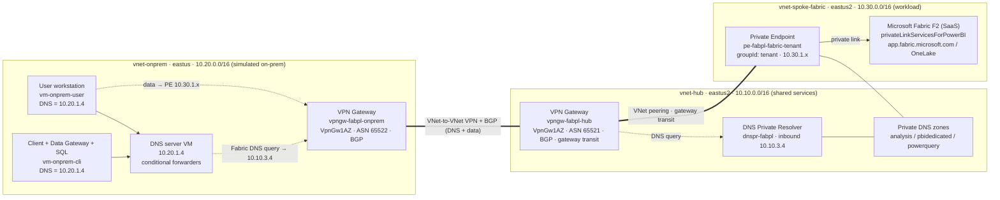

# Microsoft Fabric Tenant Private Link — VPN‑Only Access Runbook

End‑to‑end runbook for the goal: **users can access Microsoft Fabric only from inside the VPN /
private network; access from the public internet is blocked.**

It documents the architecture and gives **step‑by‑step instructions in two forms for every step** —
**Infrastructure as Code (IaC: Bicep / `azd` / `az`)** and the **Azure Portal (GUI)** — plus the
**Fabric admin‑portal** actions that are not deployable by ARM. It also captures the real‑world
fixes and gotchas discovered while building this lab (VPN AZ SKU, DNS conditional forwarding for
OneLake, lockout prevention, on‑prem data gateway egress).

> Audience: platform / network / Fabric admins. The lab was built in a throwaway subscription and
> resource group `rg-fabricpl-dev`; substitute your own subscription, names, and credentials.

---

## 1. Outcome and the two independent controls

"Fabric only over VPN" is achieved by combining **two independent controls** — keep them separate in
your head, because they govern different directions of traffic:

| Control | Direction | What it does | Where configured |
| --- | --- | --- | --- |
| **Tenant Azure Private Link + Block Public Internet Access** | **Inbound** (user → Fabric) | Makes Fabric reachable only through approved private endpoints; rejects public‑internet access. | Fabric **admin portal** (not IaC) |
| **Private DNS + VPN routing** | **Inbound path** | Resolves Fabric FQDNs to the private endpoint IP and routes them over the VPN. | IaC + on‑prem DNS |
| **On‑prem data gateway egress allow‑list** | **Outbound** (gateway → Fabric) | Restricts the gateway server to only the Microsoft endpoints it needs. Outbound‑only; not governed by Block Public Internet Access (verify after enabling it). | On‑prem firewall / NSG |

If you enable Block Public Internet Access **before** the private DNS + VPN path fully works, you
lock everyone out. §9 is the mandatory pre‑flight that prevents that.

---

## 2. Architecture



### Components and why each exists

- **Hub VNet (`10.10.0.0/16`, eastus2)** — shared connectivity/DNS: the hub VPN gateway and the DNS
  Private Resolver inbound endpoint (`10.10.3.4`). The private DNS zones are linked here.
- **Spoke VNet (`10.30.0.0/16`, eastus2)** — the Fabric workload: the **tenant** private endpoint
  (`pe-fabpl-fabric-tenant`, subnet `snet-pe`). The F2 capacity is a regional resource and
  `privateLinkServicesForPowerBI` is a tenant/global resource; they're grouped with the spoke as the
  workload it reaches privately.
- **On‑prem VNet (`10.20.0.0/16`, eastus, simulated)** — DNS server VM (`10.20.1.4`), a user
  workstation, and a client VM that hosts the **on‑prem data gateway** and the **SQL test source**.
- **VNet‑to‑VNet VPN + BGP** — carries both the DNS queries (on‑prem DNS → resolver) and the data
  (on‑prem → private endpoint). **BGP advertises the spoke prefix `10.30.0.0/16`** to on‑prem so it
  has a route, not just a DNS answer.
- **Hub↔spoke peering with gateway transit** — `allowGatewayTransit` on the hub side +
  `useRemoteGateways` on the spoke side lets on‑prem traffic reach the spoke through the hub gateway.

### Three traffic flows

1. **DNS:** on‑prem client → on‑prem DNS server (`10.20.1.4`) → conditional forwarders →
   resolver inbound (`10.10.3.4`, over VPN) → private DNS zones → returns **private** PE IP
   (`10.30.1.x`).
2. **Data (user → Fabric):** browser → private IP → VPN tunnel → hub → peering → spoke PE → Fabric.
3. **Control/egress (data gateway → Fabric):** gateway server → **public** Microsoft endpoints
   (Service Bus / Entra) outbound only. This path is intentionally public and is governed by the
   egress allow‑list (§8), not by private link.

---

## 3. As‑built inventory (verified)

| Resource | Name | Key facts |
| --- | --- | --- |
| Resource group | `rg-fabricpl-dev` | eastus2 |
| Hub VNet | `vnet-fabpl-hub` | `10.10.0.0/16`; `snet-dnspr-inbound` `10.10.3.0/28`, `GatewaySubnet` `10.10.255.0/27` |
| Spoke VNet | `vnet-fabpl-spoke-fabric` | `10.30.0.0/16`; `snet-pe` `10.30.1.0/24` |
| On‑prem VNet | `vnet-fabpl-onprem` | `10.20.0.0/16`; `snet-dns` `10.20.1.0/24`, `snet-client` `10.20.2.0/24`, `GatewaySubnet` `10.20.255.0/27` |
| DNS Private Resolver | `dnspr-fabpl` | inbound endpoint `10.10.3.4` |
| Private DNS zones | `privatelink.analysis.windows.net`, `privatelink.pbidedicated.windows.net`, `privatelink.prod.powerquery.microsoft.com` | linked to hub VNet |
| Fabric capacity | `fabplcapbrykjbkokrw34` | SKU `F2`, eastus2 |
| Private Link service | `pls-fabpl-fabric` | `Microsoft.PowerBI/privateLinkServicesForPowerBI` |
| Private endpoint | `pe-fabpl-fabric-tenant` | groupId **`tenant`**, subnet `snet-pe`, **Approved** |
| Hub VPN gateway | `vpngw-fabpl-hub` | **`VpnGw1AZ`**, ASN 65521, BGP, zoned PIP |
| On‑prem VPN gateway | `vpngw-fabpl-onprem` | **`VpnGw1AZ`**, ASN 65522, BGP, zoned PIP |
| VPN connections | `cn-hub-to-onprem`, `cn-onprem-to-hub` | Vnet2Vnet, BGP, **Connected** |
| DNS server VM | `vm-onprem-dns` | `10.20.1.4`, conditional forwarders |
| Client VM | `vm-onprem-cli` | on‑prem data gateway + SQL Express test source |
| User VM | `vm-onprem-user` | end‑user workstation |

### 3.1 Private endpoint(s) required by this repo

This architecture needs **exactly one private endpoint** — the **Fabric tenant** private endpoint.
That single PE makes the **entire Fabric/Power BI tenant** (portal, APIs, OneLake, all workspaces and
capacities) reachable privately. IaC: `infra/modules/fabric.bicep` (PE + Private Link service) and
`infra/modules/privatedns.bicep` (zones).

| Property | Value |
| --- | --- |
| Private endpoint | `pe-fabpl-fabric-tenant` (`Microsoft.Network/privateEndpoints`) |
| Target service | `pls-fabpl-fabric` — `Microsoft.PowerBI/privateLinkServicesForPowerBI` (**not** the Fabric capacity directly; Fabric reuses the Power BI Private Link plumbing) |
| **Target sub‑resource (groupId)** | **`tenant`** |
| Subnet | `vnet-fabpl-spoke-fabric/snet-pe` (`10.30.1.0/24`) |
| DNS integration (zone group `default`) | 3 private DNS zones below |
| A records projected | One PE registers **~14+ A records** across the 3 zones (e.g. `api`, `app`, `onelake`, plus many `pbidedicated` GUIDs) at `10.30.1.x` |

**The three private DNS zones the PE integrates with** (each linked to the hub VNet; they back the
public parents the on‑prem DNS forwards — §7.3):

| Private DNS zone | Backs public parent |
| --- | --- |
| `privatelink.analysis.windows.net` | `analysis.windows.net` / `powerbi.com` (portal, APIs) |
| `privatelink.pbidedicated.windows.net` | `pbidedicated.windows.net` / OneLake (`fabric.microsoft.com`) |
| `privatelink.prod.powerquery.microsoft.com` | `prod.powerquery.microsoft.com` |

**Key points**

- It is a **tenant‑level** private endpoint: **one PE per tenant** covers all workspaces and
  capacities. You do **not** create a PE per workspace, per capacity, or per Fabric item in this
  design.
- The valid sub‑resource (groupId) for this design is **`tenant`** only.
- **What does NOT need a private endpoint here:** the SQL Express source, the on‑prem data gateway,
  and the VMs — they are reached over the **VPN / VNet** directly (the gateway talks *outbound* to
  Fabric, §8). OneLake, the portal, and the APIs are **all** covered by the single tenant PE, so they
  need no separate endpoints.

> **Alternative not used by this repo — workspace‑level private link** (sub‑resource `workspace`):
> a **separate PE per workspace**, giving per‑workspace inbound isolation. If you adopt it (e.g. with
> the **VNet data gateway**, §12.4), the gateway must sit in the **same VNet as the workspace
> private‑link endpoint**. This repo uses the simpler **tenant** PE instead.

---

## 4. Prerequisites

1. **Fabric administrator** role (for tenant settings) and rights to create a **Fabric capacity**.
2. `fabricCapacityAdmin` = a real **Entra user UPN** or service‑principal object id.
3. Tools for the IaC path: `az` CLI, `az bicep`, optionally `azd`. For GUI: Owner/Contributor on the
   subscription.
4. Non‑overlapping address spaces (`10.10` / `10.20` / `10.30`) — required for gateway transit.

> **Bootstrapping order caveat:** `Microsoft.PowerBI/privateLinkServicesForPowerBI` **fails to
> create until tenant Azure Private Link is enabled** in the Fabric admin portal (§6, Step 1). If you
> are deploying from scratch, deploy with `deployFabricPrivateLink=false`, enable tenant Private
> Link, then redeploy with it `true`.

---

## 5. Deploy the Azure infrastructure

### 5.1 IaC path (recommended)

The whole network + Fabric + VPN + DNS resolver stack is one Bicep template
(`infra/resources.bicep`, compiled to `azuredeploy.json`).

**Option A — `azd`:**
```bash
azd env new fabricpl-dev
azd env set FABRIC_CAPACITY_ADMIN  admin@contoso.com
azd env set VM_ADMIN_PASSWORD      '<StrongP@ssw0rd!>'
azd env set VPN_SHARED_KEY         '<shared-key>'
azd env set AZURE_LOCATION         eastus2
azd provision                      # gateways take ~30–45 min
```

**Option B — `az` subscription scope (creates the RG):**
```bash
az deployment sub create \
  --location eastus2 \
  --template-file infra/main.bicep \
  --parameters environmentName=fabricpl fabricCapacityAdmin='admin@contoso.com' \
               adminPassword='<StrongP@ssw0rd!>' vpnSharedKey='<shared-key>'
```

**Option C — `az` resource‑group scope (matches the Deploy‑to‑Azure button artifact):**
```bash
az group create -n rg-fabricpl-dev -l eastus2
az deployment group create -g rg-fabricpl-dev \
  --template-file azuredeploy.json --parameters @azuredeploy.parameters.json \
  --parameters adminPassword='<StrongP@ssw0rd!>' vpnSharedKey='<key>' fabricCapacityAdmin='admin@contoso.com'
```

**Preview before applying (recommended):**
```bash
azd provision --preview            # or: az deployment sub what-if ...
```

After editing any Bicep, **recompile the ARM template** so the GUI/button path stays in sync:
```bash
az bicep build --file infra/resources.bicep --outfile azuredeploy.json
```

### 5.2 Azure Portal (GUI) path

If you build by hand instead of IaC, create resources in this order (dependencies flow downward).
Names below match the as‑built inventory.

1. **Resource group** → Portal → *Resource groups* → **Create** → `rg-fabricpl-dev`, eastus2.
2. **Hub VNet** `vnet-fabpl-hub` (`10.10.0.0/16`, eastus2) with subnets:
   - `snet-dnspr-inbound` `10.10.3.0/28` → **delegate** to `Microsoft.Network/dnsResolvers`.
   - `GatewaySubnet` `10.10.255.0/27` (exact name required).
3. **Spoke VNet** `vnet-fabpl-spoke-fabric` (`10.30.0.0/16`, eastus2) with subnet `snet-pe`
   `10.30.1.0/24` (disable network policies for private endpoints if prompted).
4. **On‑prem VNet** `vnet-fabpl-onprem` (`10.20.0.0/16`, eastus) with subnets `snet-dns`
   `10.20.1.0/24`, `snet-client` `10.20.2.0/24`, `GatewaySubnet` `10.20.255.0/27`.
5. **DNS Private Resolver** → *Create a resource* → "DNS Private Resolver" → name `dnspr-fabpl`,
   VNet `vnet-fabpl-hub` → add an **inbound endpoint** in `snet-dnspr-inbound` with **static** IP
   `10.10.3.4`.
6. **Private DNS zones** (create all three, then **Virtual network link** each to `vnet-fabpl-hub`,
   auto‑registration **off**):
   `privatelink.analysis.windows.net`, `privatelink.pbidedicated.windows.net`,
   `privatelink.prod.powerquery.microsoft.com`.
7. **Fabric capacity** → *Create a resource* → "Microsoft Fabric" → name e.g. `fabplcap…`, SKU `F2`,
   region eastus2, **Capacity administrator** = your UPN.
8. **VPN gateways** (one per VNet — see §7 for the **AZ SKU requirement**):
   - Public IP: **Standard**, **zone‑redundant** (zones 1,2,3). *(Critical — see §7.)*
   - Gateway: type **VPN**, SKU **`VpnGw1AZ`**, route‑based, **BGP on** with ASN `65521` (hub) /
     `65522` (on‑prem), in each VNet's `GatewaySubnet`.
9. **VNet‑to‑VNet connections** → on each gateway → *Connections* → **Add** → type
   **VNet‑to‑VNet**, enable **BGP**, same **shared key** on both (`cn-hub-to-onprem`,
   `cn-onprem-to-hub`).
10. **Hub↔spoke peering** with gateway transit:
    - Hub→spoke: **Allow gateway transit** = on, **Use remote gateways** = off.
    - Spoke→hub: **Allow gateway transit** = off, **Use remote gateways** = on.
11. **Fabric tenant Private Link service** → *Create a resource* → search
    "Power BI Private Link" (`Microsoft.PowerBI/privateLinkServicesForPowerBI`) → name
    `pls-fabpl-fabric`, your tenant id. *(Requires §6 Step 1 done first.)*
12. **Private endpoint** `pe-fabpl-fabric-tenant`:
    - Resource: the `pls-fabpl-fabric` service, **target sub‑resource `tenant`**.
    - Network: VNet `vnet-fabpl-spoke-fabric`, subnet `snet-pe`.
    - DNS: integrate with the **three private DNS zones** from Step 6.
13. **On‑prem VMs** — DNS server (`vm-onprem-dns`, static `10.20.1.4` in `snet-dns`), client
    (`vm-onprem-cli` in `snet-client`), user (`vm-onprem-user` in `snet-client`). DNS server
    assignment matters and is **not uniform**:
    - `vm-onprem-dns` NIC → **`168.63.129.16`** (Azure platform DNS). It must bootstrap before its
      own DNS role/forwarders exist; pointing it at itself with no zones configured yields no
      resolution. Configure the DNS Server role on it per §7.3.
    - `vm-onprem-cli` and `vm-onprem-user` NICs (and/or the on‑prem VNet's default DNS) →
      **`10.20.1.4`** (the on‑prem DNS server VM).

---

## 6. Fabric admin‑portal steps (not deployable by IaC)

These are tenant settings in **Fabric → Settings (gear) → Admin portal → Tenant settings →
Advanced networking**. You must be a **Fabric administrator**.

### Step 1 — Enable **Azure Private Link** (prerequisite)
Turn **Azure Private Link** **On**. It takes ~15 minutes to configure the tenant FQDN. This is what
makes the `privateLinkServicesForPowerBI` + private endpoint valid. **Do this before** creating the
PLS/PE (or before redeploying with `deployFabricPrivateLink=true`).

### Step 2 — Approve the private endpoint connection (if not auto‑approved)
Portal → the `pls-fabpl-fabric` resource (or the PE) → **Private endpoint connections** → select
`pe-fabpl-fabric-tenant` → **Approve**. Verify state = **Approved**
(as‑built: already Approved).

### Step 3 — Verify the private path works end‑to‑end (do §9 now)
**Before** locking down, confirm the on‑prem user VM resolves Fabric to private IPs and can reach
the portal over the VPN. This is the lockout pre‑flight in §9.

### Step 4 — Enable **Block Public Internet Access** (the VPN‑only switch)
Admin portal → Tenant settings → Advanced networking → **Block Public Internet Access** → **On**.
After this applies (~15 min), supported Fabric items are reachable **only** through private
endpoints; public‑internet logins are blocked. This is the setting that delivers "VPN‑only access."

> **Effects to expect:** Block Public Internet Access is tenant‑wide. It disables some unsupported
> Fabric items (Copilot, email subscriptions, non‑open mirroring, external event sources, etc.) and
> pauses non‑private database mirroring scenarios — see **§12** for the full availability breakdown.
> Entra sign‑in (`login.microsoftonline.com`) and CDNs remain public — that is normal and required.

### Step 5 — Workspace inbound settings: leave as **Not configured**
The workspace **"Allow public addresses to access this workspace"** / **"Allow inbound trusted
resources"** screen is **workspace‑level private link**, a *different* feature. In this tenant‑PE
architecture you should **leave both Not configured and click Cancel**:

- Restricting a workspace there makes it reject the **tenant** private endpoint and require its own
  **workspace** private endpoint (which this design does not deploy) → it would break your VPN path.
- Adding IPs under "Address configurations" would *open* a public allow‑list — the opposite of the
  goal.

---

## 7. VPN gateway — AZ SKU requirement (important)

Non‑AZ `VpnGw1`–`VpnGw5` SKUs are **no longer allowed** for new VPN gateways. Azure rejects them:

```
NonAzSkusNotAllowedForVPNGateway: VpnGw1-5 non-AZ SKUs are no longer supported for VPN gateways.
Only VpnGw1-5AZ SKUs can be created going forward.
```

AZ gateway SKUs additionally require their **public IP to have zones configured**:

```
VmssVpnGatewayPublicIpsMustHaveZonesConfigured: Standard Public IPs associated with VPN Gateways
with AZ VPN skus must have zones configured.
```

So **both** of these are mandatory:
1. Gateway SKU = **`VpnGw1AZ`** (or `…2AZ`–`…5AZ`).
2. Public IP = **Standard**, **zone‑redundant** with `zones: ['1','2','3']`.

### 7.1 IaC (already applied in this repo)
`infra/modules/vpngateway.bicep`:
```bicep
@description('Gateway SKU. Must be an AZ SKU (VpnGw1AZ-VpnGw5AZ)…')
param skuName string = 'VpnGw1AZ'

resource pip 'Microsoft.Network/publicIPAddresses@2023-11-01' = {
  name: '${name}-pip'
  location: location
  sku: { name: 'Standard' }
  zones: ['1','2','3']               // required for AZ gateway SKUs
  properties: { publicIPAllocationMethod: 'Static' }
}
```
After editing, recompile: `az bicep build --file infra/resources.bicep --outfile azuredeploy.json`.

> **Public IP zones are immutable.** If a no‑zone PIP already exists (e.g. from a failed earlier
> deploy) and is unassociated, delete it so it can be recreated with zones:
> `az network public-ip delete -g rg-fabricpl-dev -n vpngw-fabpl-hub-pip`.

### 7.2 GUI
When creating each VPN gateway: create the **Public IP** as **Standard** and set **Availability
zone = Zone‑redundant**; set the **Gateway SKU = `VpnGw1AZ`**.

### 7.3 On‑prem DNS server configuration (the conditional forwarders)
On `vm-onprem-dns`, the DNS Server role is configured with:
- **Default forwarder** `168.63.129.16` (Azure platform DNS — a special non‑internet‑routable
  address; resolves everything *not* Fabric). **Do not remove it** — without it the gateway can't
  resolve its public endpoints and the OS loses general name resolution.
- **Conditional forwarders → `10.10.3.4`** (resolver inbound) for the Fabric/Power BI **broad parent
  domains**:
  ```
  analysis.windows.net
  pbidedicated.windows.net
  prod.powerquery.microsoft.com
  powerbi.com
  fabric.microsoft.com
  ```

> **Why broad parents, not `app.fabric.microsoft.com`:** a narrow `app.*` forwarder leaks **OneLake**
> (`onelake.dfs/blob.fabric.microsoft.com`) to public DNS, because its public CNAME chain resolves
> fully before the privatelink hop is re‑queried. Forwarding the **parent** `fabric.microsoft.com`
> (and `powerbi.com`) sends the whole name family — portal, APIs, and OneLake — to the private
> resolver. This is set in `forwarderDomains` in `infra/resources.bicep`.

PowerShell to (re)configure conditional forwarders on the DNS server:
```powershell
$resolver = '10.10.3.4'
$broad = 'analysis.windows.net','pbidedicated.windows.net','prod.powerquery.microsoft.com','powerbi.com','fabric.microsoft.com'
# remove any narrow app.* forwarders, then add broad parents
foreach($z in 'app.powerbi.com','app.fabric.microsoft.com'){ if(Get-DnsServerZone -Name $z -EA SilentlyContinue){ Remove-DnsServerZone -Name $z -Force } }
foreach($z in $broad){ if(-not (Get-DnsServerZone -Name $z -EA SilentlyContinue)){ Add-DnsServerConditionalForwarderZone -Name $z -MasterServers $resolver } }
Clear-DnsServerCache -Force
```

> **Cosmetic "<Unable to resolve>" in DNS Manager:** the *Server FQDN* column shows
> `<Unable to resolve>` next to `10.10.3.4` / `168.63.129.16`. That is a reverse‑DNS (PTR) display
> only and does **not** affect forwarding — forward queries resolve correctly. Ignore it.

---

## 8. On‑prem data gateway (outbound egress control)

Install the **standard on‑premises data gateway** on `vm-onprem-cli` (general‑purpose client, on
`snet-client`, uses the on‑prem DNS server so it resolves Fabric privately). Keep the **DNS server**
VM and the **user** workstation free of it.

> ⚠️ **Supportability caveat (read §12.4):** Microsoft does **not** support the standard on‑premises
> data gateway with **Azure Private Link enabled** — registering a new gateway throws
> `System.NullReferenceException`. This lab uses it only to demonstrate the data path. Either
> register it with Azure Private Link **temporarily disabled** (then re‑enable), or — recommended for
> production — use the **VNet data gateway**, which natively supports private link.

### 8.1 Outbound egress allow‑list (do NOT allow‑list by public IP)
Microsoft's gateway endpoints sit behind large, rotating Azure ranges, so **you cannot safely
allow‑list by static public IP**. Allow **outbound** to these **FQDNs** (the gateway needs **no
inbound**):

| FQDN | Ports | Purpose |
| --- | --- | --- |
| `*.servicebus.windows.net` | 443, 5671‑5672, 9350‑9354 | Azure Relay/Service Bus — the data channel |
| `*.analysis.windows.net` | 443 | Identify the Power BI/Fabric cluster |
| `login.microsoftonline.com`, `*.login.windows.net`, `login.live.com` | 443 | Entra sign‑in |
| `aadcdn.msauth.net` | 443 | Auth CDN |
| `dc.services.visualstudio.com` | 443 | Telemetry (optional) |

After registration, the only endpoints that must stay open are the **Azure Relay**
(`*.servicebus.windows.net`) ones.

**Make FQDN filtering airtight — enable HTTPS‑only mode:** Gateway app → **Network** tab → set
*"Use HTTPS to communicate with Azure Service Bus"* = **On** → restart the gateway service. It then
uses **443 + FQDNs only** (no 5671/9350 and no raw‑IP fallback), so the FQDN rules fully cover it.

### 8.2 Where to enforce it
- **Azure NSGs cannot match FQDNs** — only IPs/service tags. So enforce the FQDN list on **Azure
  Firewall** (application rules) or an **on‑prem proxy**. In a real on‑prem network this is your
  corporate firewall/proxy egress allow‑list.
- **NSG‑only alternative (coarser, no extra infra):** allow outbound **service tags** `ServiceBus`,
  `AzureActiveDirectory`, `AzureCloud` on 443 (+5671/9350‑9354 if not HTTPS‑only), then `DenyAll`.
- If your proxy does **TLS inspection**, **bypass/exclude** these gateway FQDNs — the Relay channel
  and AAD auth break under MITM inspection.

> This egress control is **separate** from Block Public Internet Access (which governs *inbound*
> access to Fabric). The gateway's traffic to Microsoft is **outbound‑only** (it opens the
> connection to Azure Relay; Fabric pushes work down that existing tunnel), so Block Public Internet
> Access should not affect gateway registration or operation. Confirm by re‑running a gateway Copy
> job after you enable Block Public Internet Access (§6 Step 4).

---

## 9. Lockout‑prevention pre‑flight (run BEFORE Block Public Internet Access)

Enabling Block Public Internet Access while Fabric still resolves to **public** IPs over the VPN
locks users out. Validate from the **on‑prem user VM** first.

### 9.1 Private endpoint approved
```bash
az network private-endpoint-connection list \
  --id /subscriptions/<sub>/resourceGroups/rg-fabricpl-dev/providers/Microsoft.PowerBI/privateLinkServicesForPowerBI/pls-fabpl-fabric \
  --query "[].{name:name,status:properties.privateLinkServiceConnectionState.status}" -o table
# expect: Approved
```

### 9.2 Fabric FQDNs resolve PRIVATE from the on‑prem user VM
Run on `vm-onprem-user` (PowerShell). All must return **10.30.x** (spoke PE), not public:
```powershell
Clear-DnsClientCache
'app.powerbi.com','api.powerbi.com','app.fabric.microsoft.com',
'onelake.dfs.fabric.microsoft.com','onelake.blob.fabric.microsoft.com' | % {
  $r = Resolve-DnsName $_ -ErrorAction SilentlyContinue
  '{0} => {1}' -f $_, (($r | ? {$_.IPAddress}).IPAddress -join ',')
}
```
Verified good result:
```
app.powerbi.com                  => 10.30.1.6
api.powerbi.com                  => 10.30.1.4
app.fabric.microsoft.com         => 10.30.1.6
onelake.dfs.fabric.microsoft.com => 10.30.1.8
onelake.blob.fabric.microsoft.com=> 10.30.1.8
```

> **If a name resolves to a public IP:** (a) flush the DNS server cache
> (`Clear-DnsServerCache -Force` on `vm-onprem-dns`) — stale public records cached before the PE
> registered are the most common cause; (b) ensure the **broad parent** forwarder exists (§7.3) — a
> narrow `app.*` forwarder leaks OneLake. Re‑test until all are private.

### 9.3 VPN tunnels Connected
```bash
az network vpn-connection show -g rg-fabricpl-dev -n cn-hub-to-onprem \
  --query "{status:connectionStatus}" -o tsv     # expect: Connected
```

Only when 9.1–9.3 all pass, enable **Block Public Internet Access** (§6 Step 4).

### 9.4 Post‑lockdown validation
- From the **on‑prem user VM (on VPN)**: browse `https://app.fabric.microsoft.com` → loads.
- From a **machine NOT on the VPN**: same URL → access blocked / fails. This proves VPN‑only.

---

## 10. SQL test source + incremental Copy job (optional, for pipeline testing)

A SQL Server Express instance on `vm-onprem-cli` provides a private on‑prem source the gateway reads.

### 10.1 What was installed
- **SQL Server Express**, instance `SQLEXPRESS`, **mixed‑mode (SQL) auth**, TCP **1433**, firewall
  open (1433/TCP, 1434/UDP), SQL Browser running.
- Admin: `sa` / `<sa-password>`. App login: `sqltest` / `<sql-login-password>` (`db_owner` on
  `TestDB`, `CHECK_POLICY=OFF`). **Lab‑only pattern — set your own strong passwords; never commit
  real credentials.**

### 10.2 Schema tuned for incremental load — `dbo.SalesOrders`
```
id            INT IDENTITY PK
customer_name NVARCHAR(100)
region        NVARCHAR(50)
amount        DECIMAL(12,2)
active        BIT            -- true/false soft-delete flag
last_update   DATETIME2(3)   -- watermark column, indexed
```
An **AFTER UPDATE trigger** auto‑advances `last_update` on any row change, so updates re‑appear in the
next incremental run.

### 10.3 Fabric Copy job (auto‑watermark)
Fabric **Copy job** in incremental mode tracks the high‑water mark itself — you only **select
`last_update` as the incremental column** and (optionally) filter `active = 1`. Connect the source
via the on‑prem data gateway: server `localhost\SQLEXPRESS` (or `<vm-ip>,1433`), database `TestDB`,
**Basic** auth `sqltest` / `<sql-login-password>`.

Generate changes between runs (connect as `sqltest`):
```sql
INSERT INTO dbo.SalesOrders (customer_name, region, amount) VALUES
 ('NewCo One','East',500.00), ('NewCo Two','West',1250.75);          -- new rows
UPDATE dbo.SalesOrders SET amount = amount + 100 WHERE customer_name='Contoso';  -- trigger bumps last_update
UPDATE dbo.SalesOrders SET active = 0 WHERE customer_name='Fabrikam';            -- soft delete
```
Expected next run: the 2 inserts + updated Contoso copied; Fabrikam flows with `active=0`.

> **Watermark incremental cannot detect hard `DELETE`s** (the row is gone, no `last_update`). Use the
> `active=0` **soft‑delete** pattern to propagate removals.

---

## 11. Troubleshooting quick reference

| Symptom | Cause | Fix |
| --- | --- | --- |
| `NonAzSkusNotAllowedForVPNGateway` | Non‑AZ VPN SKU | Use `VpnGw1AZ` (§7). |
| `VmssVpnGatewayPublicIpsMustHaveZonesConfigured` | No‑zone PIP on AZ gateway | Set PIP `zones: ['1','2','3']`; delete + recreate (zones immutable). |
| Fabric portal/OneLake resolves to **public** IP over VPN | Stale DNS cache, or narrow `app.*` forwarder | `Clear-DnsServerCache -Force`; use **broad parent** forwarders `powerbi.com` + `fabric.microsoft.com` (§7.3). |
| Conditional forwarder shows `<Unable to resolve>` FQDN | Reverse‑DNS (PTR) display only | Cosmetic — ignore; forward resolution works. |
| `168.63.129.16` appears as a forwarder / "public IP" | Azure platform DNS (default forwarder) | Expected; non‑internet‑routable; **do not remove**. Carries only non‑Fabric traffic. |
| Data gateway can't register | Egress to Service Bus / Entra blocked | Allow the §8 FQDNs; enable HTTPS‑only mode. |
| PE connection not Approved | Pending approval | Approve in the PLS **Private endpoint connections** blade (§6 Step 2). |
| Immediate post‑deploy `nslookup` fails | New capacity / DNS propagation (up to 24h) | Wait; re‑test. Not a deploy error. |

---

## 12. Fabric feature availability over Private Link / Block Public Internet Access

When you lock Fabric to private access, **not every Fabric experience works** — and the two tenant
settings have **different blast radius**. Verify against the live Microsoft list before relying on a
specific feature, as it changes over time (sources in §16; checked 2026‑06).

### 12.1 Two settings, two tiers of impact

- **Azure Private Link = On** (private endpoints valid, public still allowed): mostly everything
  works, but a few **Power BI export/web** features are disabled, and the **standard on‑premises data
  gateway can't register** (§12.4).
- **+ Block Public Internet Access = On** (the VPN‑only switch): stricter. Additional items are
  disabled — email subscriptions, Copilot, non‑private mirroring, external Azure event sources,
  usage‑metrics refresh, etc.

> "Supported Fabric items are only accessible from private endpoints; **unsupported items become
> disabled**." Block Public Internet Access is **tenant‑wide**.

### 12.2 Works over Private Link (supported)

| Experience | Notes |
| --- | --- |
| **Power BI** reports & semantic models (interactive) | Works over the private endpoint. Report Page Views / performance telemetry are **not captured** over private link. |
| **Data Warehouse / SQL analytics endpoint** | TDS endpoint reachable privately. |
| **OneLake** (DFS/Blob) | Reachable via the tenant PE — provided DNS resolves the broad parents privately (§7.3). |
| **Data Engineering — Spark** (notebooks, Spark job definitions, pipeline Spark activities) | Works; with **Workspace Outbound Access Protection**, Spark reaches external resources only via **managed private endpoints**. Runtime ≥ Spark 3.x. |
| **Eventstream** | Supports Private Link for secure ingestion. |
| **Data pipelines / Copy job** | Work; on‑prem sources need a gateway — **use the VNet data gateway** (§12.4). |
| **Dataflows Gen2 (CI/CD)** | Manage in private‑link workspaces via the Fabric portal or REST API. |
| **Data Activator (Reflex)** | Ingests events from KQL/Eventhouse, Power BI, and Real‑Time Hub for tenant‑level Private Link. |
| **Mirrored database — open mirroring** | Private Link supported (publisher writes to the OneLake landing zone via private link). |

### 12.3 Disabled or not supported

| Item | Triggered by | Behavior |
| --- | --- | --- |
| **Standard on‑premises data gateway registration** | Azure Private Link **enabled** | Registration/migrate/restore/takeover **fails** (`NullReferenceException`). Use the **VNet data gateway** (§12.4). |
| **Copilot** (all Fabric Copilots) | Private Link / closed network | Not supported. |
| **Publish to Web** | Azure Private Link enabled | Not supported. |
| **Export Power BI report to PDF / PowerPoint** | Azure Private Link enabled | Not supported. |
| **Email subscriptions** | Block Public Internet Access | Not supported. |
| **Usage metrics report refresh** | Private Link **and** Block Public Internet Access | Refresh fails; report shows no data. |
| **Non‑open database mirroring** (Snowflake, Azure SQL MI, etc.) | Block Public Internet Access / deny public | Active mirrors **pause**; can't start. Only **open mirroring** via private link. |
| **External Azure event sources** (into Eventstream/Activator) | Block Public Internet Access | Events from outside the tenant are **dropped** at the source. |
| **Cross‑tenant** OneLake sharing, cross‑tenant shortcuts, cross‑tenant PE | Always (single‑tenant boundary) | Not supported over Private Link; use OneLake data‑sharing controls. |
| **Cross‑region private‑link access for SQL sources** | Always | Not supported. |
| **API for GraphQL** with artifact + data source in different regions | Public access disabled | Not supported. |
| **Data Agents** with Kusto / semantic model / mirrored data sources | Private Link | Those source types aren't supported as Data Agent sources. |

### 12.4 Important for THIS lab — the on‑premises data gateway caveat

Microsoft documents: **"Using an on‑premises data gateway with private link enabled isn't supported.
We recommend using the VNet data gateway, which does support private link scenarios."** Registering a
new gateway (or migrate/restore/takeover) while **Azure Private Link is enabled** throws
`System.NullReferenceException` in the configurator.

What this means for you:

- This lab installs the **standard on‑prem data gateway** to demonstrate the on‑prem→Fabric data
  path, but it is **not the Microsoft‑supported pattern** for a private‑link tenant.
- **Registration workaround (per docs):** temporarily **disable Azure Private Link** (Admin portal →
  Advanced networking), register/configure the gateway, then **re‑enable Azure Private Link**. The
  gateway's *runtime* (outbound to Azure Relay) is unaffected once configured.
- **Recommended for production: the VNet data gateway**, which natively supports private link. For
  **workspace‑level** private link it must sit in the **same VNet as the workspace private‑link
  endpoint**. This avoids the registration limitation entirely and keeps the data path private.

---

## 13. Production hardening, limitations & best practices

This repo is a **functional lab**. The private‑link/VPN pattern is production‑grade, but several
implementation choices are deliberately simplified. Below: what's limited, what to change for
production, and which good practices are already baked in.

### 12.1 Limitations of this lab (by design)

| Area | Lab choice | Why it's a limitation |
| --- | --- | --- |
| "On‑prem" | A second **Azure VNet** (`vnet-onprem`) joined by **VNet‑to‑VNet** VPN | Not a real on‑premises site; real on‑prem connects via **Site‑to‑Site VPN** or **ExpressRoute**. |
| VPN SKU | `VpnGw1AZ`, active‑standby | Smallest AZ SKU; limited throughput/tunnels and a single active instance (no active‑active SLA). |
| DNS server | Single Windows VM (`vm-onprem-dns`) doing conditional forwarding | **Single point of failure**; no redundancy. |
| Secrets | `adminPassword` / `vpnSharedKey` passed as deployment **parameters**; SQL uses **SQL auth** with a simple `db_owner` login | No Key Vault; SQL auth + weak password is lab‑only. |
| VM access | Local admin password; `deployBastion=false`; `lockdownOutbound=false` | RDP/management exposure and unrestricted egress unless you enable Bastion / lockdown. |
| Data source | **SQL Express** on the **same VM** as the data gateway | Co‑hosting + Express edition is fine for testing, not for real load/HA. |
| Capacity | Single **F2**, single region | No HA/DR; F2 is the smallest SKU. |
| Egress | Client NSG has **no custom outbound rules** (effective: AllowInternet then DenyAll) | The gateway can reach the whole internet; not yet restricted to the §8 allow‑list. |
| Observability | No diagnostic settings / monitoring deployed | No logs/metrics/alerts for VPN, PE, or the gateway. |

### 12.2 What to change for production

1. **Connectivity:** replace the simulated `vnet-onprem` + VNet‑to‑VNet with a real **Site‑to‑Site
   VPN** or **ExpressRoute** (with Microsoft peering, ExpressRoute can also carry the private‑link
   traffic). Size the gateway up (`VpnGw2AZ`+), and use **active‑active, zone‑redundant** gateways for
   the connectivity SLA.
2. **Identity & secrets:** move `adminPassword`, `vpnSharedKey`, and SQL credentials into **Azure Key
   Vault**; reference them from Bicep/`azd` or your pipeline. Prefer **Entra authentication** for SQL
   (managed identity) over SQL auth. For VMs, use **Entra login + Just‑in‑Time access + no public
   IP**, reached via **Bastion** (`deployBastion=true`) or the VPN.
3. **DNS:** in a real network, add the Fabric **conditional forwarders to your enterprise DNS**
   (or use the Azure DNS Private Resolver with a **forwarding ruleset / outbound endpoint**). Make
   DNS **highly available** (the lab's single VM is a SPOF). Keep using the **broad parent** domains
   (§7.3) to avoid the OneLake leak.
4. **Network egress:** restrict outbound. Either set `lockdownOutbound=true` **and** add explicit
   allow rules, or front the spoke/on‑prem with **Azure Firewall** for **FQDN‑based** egress
   filtering (required to enforce the §8 gateway allow‑list, since NSGs can't match FQDNs). Add NSGs
   to every subnet; deny RDP from the internet.
5. **Data gateway:** install on a **dedicated, hardened server** (not co‑hosted with SQL), and run a
   **gateway cluster (2+ members)** for HA. Store the **recovery key** securely, enable **HTTPS‑only
   mode** and auto‑update.
6. **Capacity & cost:** size the capacity (F8+) to the workload; add a **pause/resume** schedule for
   non‑prod; plan **multi‑region/DR** if required. VPN gateways and capacity are the main cost drivers.
7. **Governance & observability:** least‑privilege **RBAC**, **resource locks**, **tags**, **Azure
   Policy**, and **diagnostic settings → Log Analytics** for the VPN gateways, private endpoint, and
   the gateway. Add **cost alerts**.
8. **IaC lifecycle:** pin provider/module versions, run **`what-if` in CI**, separate
   **dev/test/prod** environments and state, and keep the ARM template (`azuredeploy.json`)
   regenerated from Bicep on every change.

### 12.3 Best practices already implemented

- **Hub‑and‑spoke** with **non‑overlapping** address spaces (gateway‑transit requirement).
- **Tenant** private endpoint (groupId `tenant`) + the three correct **private DNS zones** linked to
  the hub, with **DNS Private Resolver** inbound for on‑prem forwarding.
- **BGP** on both gateways/connections to advertise the spoke prefix across the VPN.
- **AZ VPN SKU** + **zone‑redundant** public IPs.
- **Broad‑parent** conditional forwarders (portal + APIs + OneLake resolve privately).
- **Block Public Internet Access** for inbound lockdown, with a **lockout pre‑flight** (§9).
- Gateway **egress allow‑list** + **HTTPS‑only** guidance.
- Secrets kept out of git (`.env`, `.azure/` gitignored); all credential params are `@secure()`.

---

## 14. Publish‑readiness checklist (public repo)

Status from the pre‑publish scan of this repo:

| Check | Status |
| --- | --- |
| `.env` (real password, real admin UPN) committed? | **No** — gitignored & untracked ✓ |
| `.azure/` (azd env, may hold secrets) committed? | **No** — gitignored & untracked ✓ |
| Secrets in **git history**? | **No** — single initial commit, only `<placeholder>` examples ✓ |
| Hardcoded secrets in tracked Bicep/params/scripts? | **No** — params are `@secure()`; `azuredeploy.parameters.json` uses `REPLACE_WITH_*` ✓ |
| Real **subscription ID / lab passwords** in `docs/` runbook? | **Removed** — redacted to placeholders ✓ |
| `LICENSE` file | **Added** — MIT ✓ |
| `SECURITY.md` / `CONTRIBUTING.md` | Optional — recommended for a public repo |
| README **Deploy to Azure** button | Has `OWNER/REPO/BRANCH` placeholders — fill in after publishing |
| Rotate the lab `VPN_SHARED_KEY` / `VM_ADMIN_PASSWORD` if reused elsewhere | Recommended (they live only in local `.env`) |

**Verdict:** safe to publish — `LICENSE` (MIT) added; the README button URL still needs filling.
No secrets are tracked or in history; the only sensitive values were in the local `.env`/`.azure/`
(gitignored) and the runbook's lab IDs/passwords (now redacted).

---

## 15. Teardown

```bash
az group delete -n rg-fabricpl-dev --yes --no-wait     # CLI / button
# or
azd down --force --purge                               # azd
```
Before disabling tenant Private Link in the Fabric admin portal, **delete all private endpoints and
private DNS zones first** (per Microsoft docs). Also turn **Block Public Internet Access** back off if
you want to restore public access.

---

## 16. References (Microsoft Learn)

- Set up and use tenant‑level private links (Fabric): https://learn.microsoft.com/fabric/security/security-private-links-use
- Secure inbound connections with Tenant and Workspace Private Links: https://learn.microsoft.com/fabric/security/security-private-links-overview
- Private endpoints for on‑premises clients (Power BI/Fabric): https://learn.microsoft.com/fabric/enterprise/powerbi/service-security-private-links-on-premises
- VPN Gateway SKU consolidation (AZ SKUs): https://learn.microsoft.com/azure/vpn-gateway/gateway-sku-consolidation
- Create a zone‑redundant virtual network gateway: https://learn.microsoft.com/azure/vpn-gateway/create-zone-redundant-vnet-gateway
- What is Azure DNS Private Resolver: https://learn.microsoft.com/azure/dns/dns-private-resolver-overview
- Azure Private Endpoint private DNS zone values: https://learn.microsoft.com/azure/private-link/private-endpoint-dns
- Adjust communication settings for the on‑premises data gateway (egress FQDNs/ports): https://learn.microsoft.com/data-integration/gateway/service-gateway-communication
- Install an on‑premises data gateway (Private Link limitation + VNet data gateway): https://learn.microsoft.com/data-integration/gateway/service-gateway-install
- VNet data gateway overview (supported for private link): https://learn.microsoft.com/data-integration/vnet/overview
- Microsoft.Fabric/capacities (ARM reference): https://learn.microsoft.com/azure/templates/microsoft.fabric/capacities
